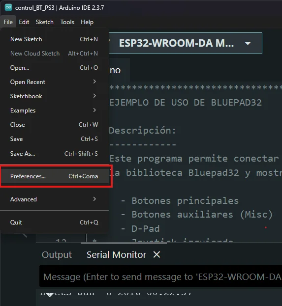
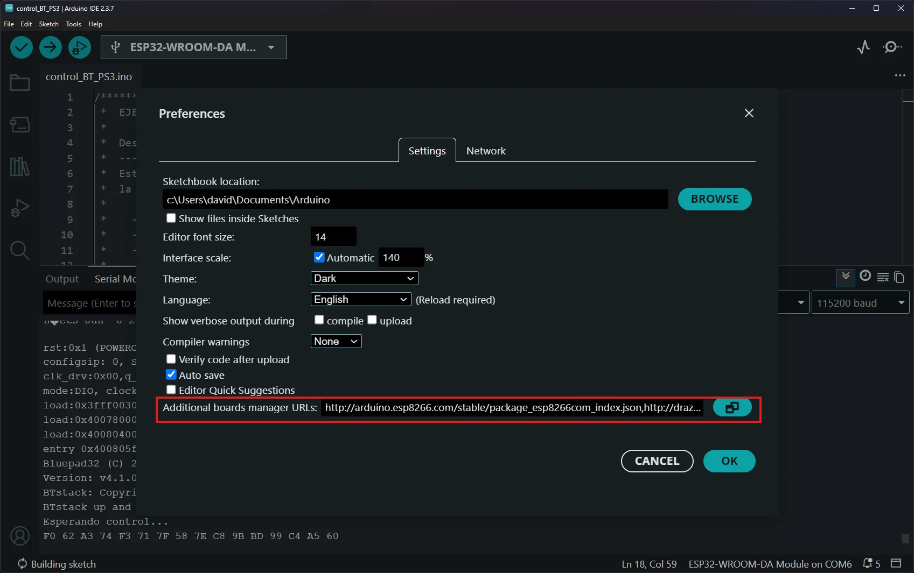
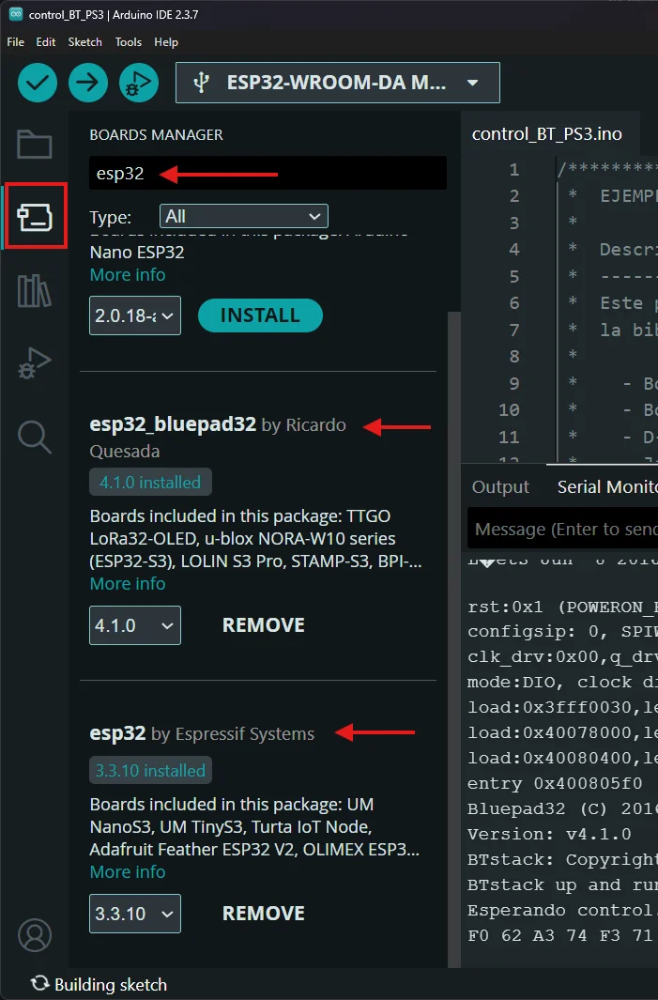
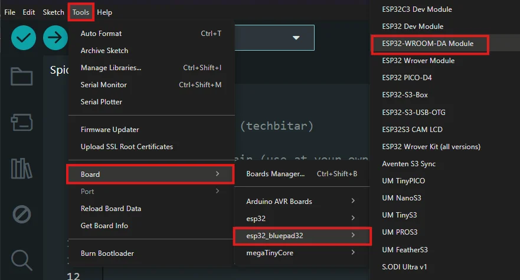

# Guía de uso de Bluepad32 con Arduino y ESP32

## 1. Agregar los paquetes de placas ESP32 y Bluepad32

1. Abra **Arduino IDE**.
2. Vaya a **File → Preferences** (Archivo → Preferencias).
    
    
    
3. En el campo **Additional Boards Manager URLs** (URLs adicionales para el Gestor de tarjetas), agregue las siguientes direcciones:



Paquete oficial ESP32

```jsx
[https://raw.githubusercontent.com/espressif/arduino-esp32/gh-pages/package_esp32_index.json](https://raw.githubusercontent.com/espressif/arduino-esp32/gh-pages/package_esp32_index.json)
```

Paquete ESP32 + Bluepad32

```jsx
https://raw.githubusercontent.com/ricardoquesada/esp32-arduino-lib-builder/master/bluepad32_files/package_esp32_bluepad32_index.json
```

**Nota:** Si ya existen otras direcciones en este campo, sepárelas mediante comas o escríbalas cada una en una línea diferente.

---

## 2. Instalar los paquetes de placas

Después de agregar las URL anteriores:

1. Abra **Tools → Board → Boards Manager**.
2. Busque **ESP32** e instale el paquete oficial de Espressif.
3. Busque **Bluepad32** e instale el paquete **ESP32 + Bluepad32**.
    
    
    

Una vez finalizada la instalación, reinicie el Arduino IDE si es necesario.

---

## 3. Seleccionar la placa

Seleccione la placa correspondiente desde:

**Tools → Board → esp32_bluepad32**

En este ejemplo se utiliza:

**ESP32-WROOM-DA Module**



---

## 4. Cargar el programa de prueba

Compile y cargue el siguiente programa en el ESP32.

```c
/***************************************************************************
 *  EJEMPLO DE USO DE BLUEPAD32
 *
 *  Descripción:
 *  ------------
 *  Este programa permite conectar un control Bluetooth compatible mediante
 *  la biblioteca Bluepad32 y mostrar en el Monitor Serie el estado de:
 *
 *    - Botones principales
 *    - Botones auxiliares (Misc)
 *    - D-Pad
 *    - Joystick izquierdo
 *    - Joystick derecho
 *    - Gatillos analógicos (L2 y R2)
 *
 *  Hardware:
 *      - ESP32
 *      - Control Bluetooth (PS3, PS4, Xbox, Switch, etc.)
 *
 ***************************************************************************/

#include <Bluepad32.h>

/*---------------------------------------------------------------------------
    Variable que almacenará el puntero al control conectado.

    ControllerPtr es una clase de Bluepad32 que contiene toda la información
    del control Bluetooth.
---------------------------------------------------------------------------*/
ControllerPtr gamepad = nullptr;

/*---------------------------------------------------------------------------
    Callback ejecutado automáticamente cuando un control se conecta.
---------------------------------------------------------------------------*/
void onConnectedController(ControllerPtr ctl) {

    // Guarda el puntero al control conectado
    gamepad = ctl;

    Serial.println("\n================================");
    Serial.println("Control conectado");

    // Muestra el nombre del modelo detectado
    Serial.printf("Modelo : %s\n", ctl->getModelName().c_str());

    Serial.println("================================");
}

/*---------------------------------------------------------------------------
    Callback ejecutado cuando el control se desconecta.
---------------------------------------------------------------------------*/
void onDisconnectedController(ControllerPtr ctl) {

    // Si el control desconectado es el mismo que estaba almacenado,
    // se elimina la referencia.
    if (gamepad == ctl)
        gamepad = nullptr;

    Serial.println("Control desconectado");
}

/*---------------------------------------------------------------------------
    SETUP
---------------------------------------------------------------------------*/
void setup() {

    // Inicializa el puerto serie
    Serial.begin(115200);

    // Inicializa Bluepad32 indicando las funciones callback
    // para conexión y desconexión.
    BP32.setup(&onConnectedController,
               &onDisconnectedController);

    /*
        Borra todas las claves Bluetooth almacenadas.

        Esto obliga a realizar un nuevo emparejamiento cada vez
        que se reinicia el ESP32.

        Una vez que el control ya esté emparejado correctamente,
        esta línea puede comentarse para evitar volver a enlazarlo.
    */
    BP32.forgetBluetoothKeys();

    /*
        Deshabilita el dispositivo virtual BLE.

        El programa utilizará únicamente Bluetooth Classic HID,
        que es el utilizado por la mayoría de controles.
    */
    BP32.enableVirtualDevice(false);

    Serial.println("Esperando control...");
}

/*---------------------------------------------------------------------------
    LOOP PRINCIPAL
---------------------------------------------------------------------------*/
void loop() {

    /*
        Actualiza el estado interno de Bluepad32.

        Esta función procesa los paquetes Bluetooth recibidos y actualiza
        la información del control.
    */
    BP32.update();

    /*
        Se verifica:

            1) Que exista un control.
            2) Que continúe conectado.
            3) Que existan datos nuevos.

        hasData() evita procesar información repetida.
    */
    if (gamepad &&
        gamepad->isConnected() &&
        gamepad->hasData()) {

        Serial.println("--------------------------------");

        //------------------------------------------------------------------
        // BOTONES PRINCIPALES
        //------------------------------------------------------------------

        /*
            Devuelve un entero de 16 bits.

            Cada bit representa un botón diferente.

            Ejemplo:

                0x0001
                0x0020
                0x0100
        */
        Serial.printf("Buttons : 0x%04X\n",
                      gamepad->buttons());

        //------------------------------------------------------------------
        // BOTONES AUXILIARES
        //------------------------------------------------------------------

        /*
            Devuelve botones especiales como:

                Select
                Start
                Home / PS
                Capture

            dependiendo del tipo de control.
        */
        Serial.printf("Misc    : 0x%02X\n",
                      gamepad->miscButtons());

        //------------------------------------------------------------------
        // D-PAD
        //------------------------------------------------------------------

        /*
            Devuelve un byte cuyos bits indican:

                Arriba
                Abajo
                Izquierda
                Derecha
        */
        Serial.printf("DPad    : 0x%02X\n",
                      gamepad->dpad());

        //------------------------------------------------------------------
        // JOYSTICK IZQUIERDO
        //------------------------------------------------------------------

        /*
            axisX()

                Movimiento horizontal.

            axisY()

                Movimiento vertical.

            Rango aproximado:

                -511  ...  512
        */
        Serial.printf("LX=%4d  LY=%4d\n",
                      gamepad->axisX(),
                      gamepad->axisY());

        //------------------------------------------------------------------
        // JOYSTICK DERECHO
        //------------------------------------------------------------------

        Serial.printf("RX=%4d  RY=%4d\n",
                      gamepad->axisRX(),
                      gamepad->axisRY());

        //------------------------------------------------------------------
        // GATILLOS ANALÓGICOS
        //------------------------------------------------------------------

        /*
            brake()

                Gatillo L2.

            throttle()

                Gatillo R2.

            Rango:

                0 ... 1023
        */
        Serial.printf("L2=%4d  R2=%4d\n",
                      gamepad->brake(),
                      gamepad->throttle());

        /*
            Pequeña pausa para evitar saturar el Monitor Serie.
        */
        delay(100);
    }
}
```

Este ejemplo permite:

- Detectar la conexión y desconexión de un mando Bluetooth.
- Mostrar en el Monitor Serie el estado de:
    - Botones principales.
    - Botones auxiliares (Misc).
    - Cruceta (D-Pad).
    - Joystick izquierdo.
    - Joystick derecho.
    - Gatillos analógicos (L2 y R2).

> **Código:** Utilice el algoritmo mostrado anteriormente sin realizar modificaciones.
> 

Una vez cargado el programa:

1. Abra el **Monitor Serie**.
2. Configure la velocidad en **115200 baudios**.

Si todo funciona correctamente, aparecerá el siguiente mensaje:

```jsx
Esperando control...
```

---

## 5. Emparejar el mando Bluetooth

Con el ESP32 encendido y el Monitor Serie abierto:

1. Mantenga presionados simultáneamente los botones **HOME + START** del mando durante unos segundos.
2. Espere hasta que los LED del control comiencen a parpadear rápidamente.
3. Suelte ambos botones.
4. Espere algunos segundos mientras Bluepad32 realiza el emparejamiento.

Si el proceso fue exitoso, en el Monitor Serie aparecerá un mensaje similar al siguiente:

```jsx
================================
Control conectado
Modelo : Wireless Controller
================================
```

A partir de ese momento, el programa comenzará a mostrar continuamente el estado de los botones, joysticks, D-Pad y gatillos del mando.

> **Importante:** El ejemplo ejecuta `BP32.forgetBluetoothKeys();`, por lo que las claves Bluetooth se eliminan cada vez que el ESP32 se reinicia. Esto obliga a realizar nuevamente el proceso de emparejamiento en cada ejecución. Una vez que el mando se haya vinculado correctamente, puede comentar o eliminar esa línea para conservar el emparejamiento entre reinicios.
> 

---

## Resultado esperado

Al mover los joysticks o presionar cualquier botón, el Monitor Serie mostrará información similar a la siguiente:

```
--------------------------------
Buttons : 0x0004
Misc    : 0x00
DPad    : 0x01
LX=  120  LY= -245
RX=    0  RY=    0
L2=   35  R2= 1023
```

Cada actualización refleja en tiempo real el estado del mando Bluetooth conectado al ESP32.